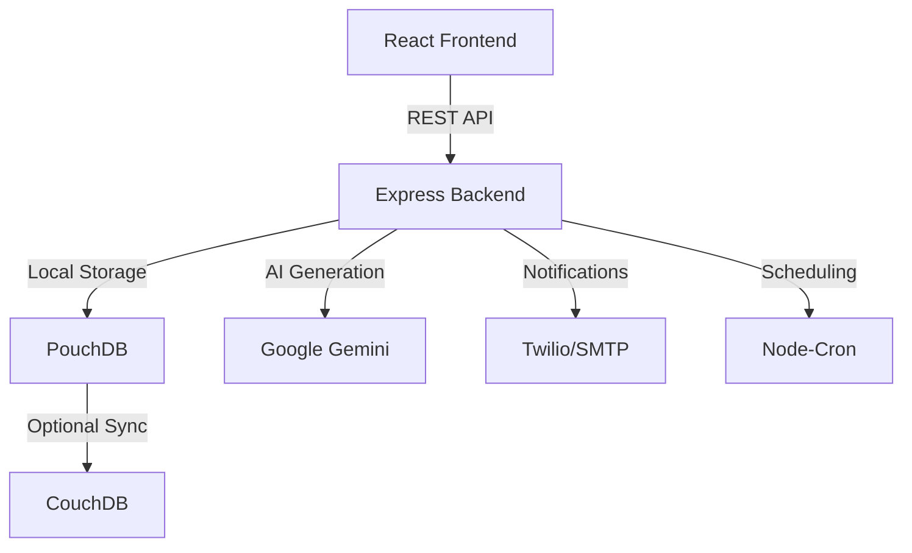

<div align="center">
  
  
  # ⚡ Taktak
  
  ### AI-Driven Offline-First Automation Platform
  
  *Shake off the manual work with intelligent workflow automation*
  
  [](https://opensource.org/licenses/MIT)
  [](https://www.typescriptlang.org/)
  [](https://reactjs.org/)
  [](https://nodejs.org/)
  
  [Features](#-features) • [Quick Start](#-quick-start) • [Architecture](#-architecture) • [Documentation](#-documentation)
  
</div>

---

## ✨ Features

<table>
<tr>
<td width="50%">

### 🎨 **Visual Workflow Builder**
Drag-and-drop interface powered by React Flow. Build complex automation workflows visually with 10+ pre-built nodes including Schedule, AI Generate, Database, SMS, Email, and more.

</td>
<td width="50%">

### 🤖 **AI-Powered Assistant**
Natural language workflow creation using Google Gemini. Simply describe what you want to automate, and let AI generate the workflow for you.

</td>
</tr>
<tr>
<td width="50%">

### 💾 **Offline-First Architecture**
Works without internet using PouchDB local storage. Optional cloud sync to CouchDB when connectivity is available. Your data, your control.

</td>
<td width="50%">

### 🔐 **Enterprise Security**
JWT authentication, encrypted credentials, and secure data handling. Built with security best practices from the ground up.

</td>
</tr>
</table>

---

## 🚀 Quick Start

### Prerequisites

```bash
Node.js 18+ • npm • (Optional) CouchDB for cloud sync
```

### Installation

```bash
# Clone the repository
git clone https://github.com/MfFischer/taktak.git
cd taktak

# Install dependencies
npm install

# Build shared types
cd packages/types && npm run build && cd ../..

# Start development servers
npm run dev:server  # Terminal 1 - Backend (port 3001)
npm run dev:client  # Terminal 2 - Frontend (port 3000)
```

### Environment Setup

Create `.env` in the root directory:

```env
# Server Configuration
PORT=3001
NODE_ENV=development
JWT_SECRET=your-super-secret-jwt-key-change-this
ENCRYPTION_KEY=your-32-character-encryption-key!!

# Optional: AI Features
GEMINI_API_KEY=your-gemini-api-key

# Optional: Cloud Sync
COUCHDB_URL=http://localhost:5984
COUCHDB_USERNAME=admin
COUCHDB_PASSWORD=password

# Optional: Notifications
TWILIO_ACCOUNT_SID=your-twilio-sid
TWILIO_AUTH_TOKEN=your-twilio-token
SMTP_HOST=smtp.gmail.com
SMTP_PORT=587
SMTP_USER=your-email@gmail.com
SMTP_PASSWORD=your-app-password
```

### 🎉 You're Ready!

Open [http://localhost:3000](http://localhost:3000) and start automating!

---

## 🏗️ Architecture

<div align="center">



</div>

### Tech Stack

<table>
<tr>
<td><b>Frontend</b></td>
<td>React 18 • TypeScript • Vite • Tailwind CSS • React Flow • React Router</td>
</tr>
<tr>
<td><b>Backend</b></td>
<td>Node.js • Express • TypeScript • PouchDB • JWT • Google Gemini AI</td>
</tr>
<tr>
<td><b>DevOps</b></td>
<td>Docker • Docker Compose • GitHub Actions • npm Workspaces</td>
</tr>
</table>

---

## 📦 Available Workflow Nodes

| Node | Description | Use Case |
|------|-------------|----------|
| ⏰ **Schedule** | Cron-based triggers | Run workflows at specific times |
| 🔀 **Condition** | Branching logic | If/else workflow paths |
| 💾 **Database** | CRUD operations | Store and retrieve data |
| 📱 **SMS** | Twilio integration | Send text messages |
| 📧 **Email** | SMTP support | Send email notifications |
| 🤖 **AI Generate** | Gemini AI | Generate text content |
| 🔗 **Webhook** | External triggers | Receive HTTP callbacks |
| 🌐 **HTTP Request** | API calls | Integrate with external services |
| 📊 **CSV Import/Export** | Data handling | Process CSV files |

---

## 🐳 Docker Deployment

```bash
# Build and run all services
docker-compose up -d

# Services available at:
# - Frontend: http://localhost:3000
# - Backend: http://localhost:3001
# - CouchDB: http://localhost:5984
```

---

## 🧪 Testing

```bash
# Run server tests
cd apps/server && npm test

# Run with coverage
npm test -- --coverage
```

---

## 📁 Project Structure

```
taktak/
├── apps/
│   ├── client/              # React frontend application
│   │   ├── src/
│   │   │   ├── components/  # Reusable UI components
│   │   │   ├── pages/       # Page components
│   │   │   └── ...
│   │   └── package.json
│   └── server/              # Express backend application
│       ├── src/
│       │   ├── engine/      # Workflow execution engine
│       │   ├── routes/      # API endpoints
│       │   ├── services/    # Business logic
│       │   └── ...
│       └── package.json
├── packages/
│   └── types/               # Shared TypeScript definitions
├── docker-compose.yml       # Docker orchestration
└── package.json             # Root workspace configuration
```

---

## 🤝 Contributing

We welcome contributions! Here's how you can help:

1. 🍴 Fork the repository
2. 🌿 Create a feature branch (`git checkout -b feature/amazing-feature`)
3. 💾 Commit your changes (`git commit -m 'Add amazing feature'`)
4. 📤 Push to the branch (`git push origin feature/amazing-feature`)
5. 🎉 Open a Pull Request

---

## 📄 License

This project is licensed under the MIT License - see the [LICENSE](LICENSE) file for details.

---

## 🙏 Acknowledgments

Built with amazing open-source tools:

- [React Flow](https://reactflow.dev/) - Beautiful workflow visualization
- [Google Gemini](https://ai.google.dev/) - Powerful AI capabilities
- [PouchDB](https://pouchdb.com/) - Reliable offline-first database
- [Tailwind CSS](https://tailwindcss.com/) - Modern utility-first CSS

---

<div align="center">
  
  **Built with ❤️ for local businesses and clinics**
  
  *Taktak - Shake off the manual work* ⚡
  
</div>

