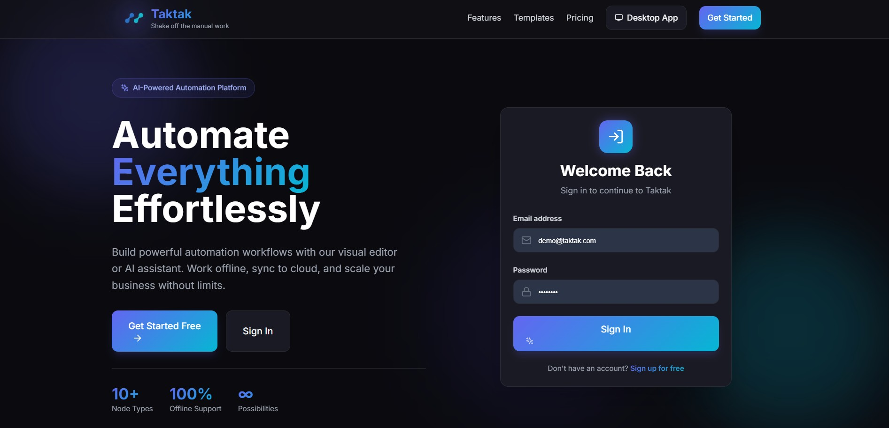
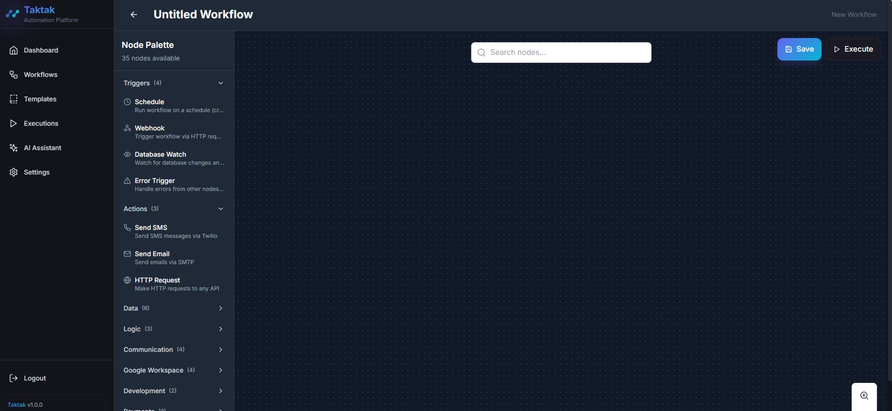
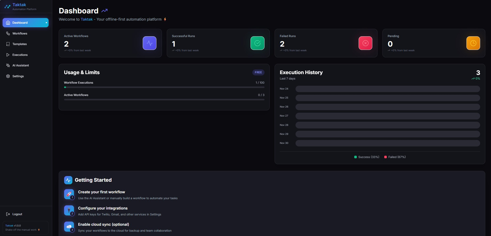
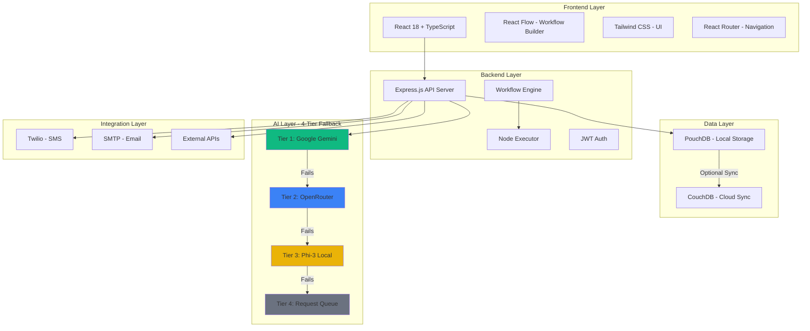

<div align="center">
  

  # ⚡ Taktak

  ### AI-Driven Offline-First Automation Platform

  *Shake off the manual work with intelligent workflow automation*

  [](https://opensource.org/licenses/MIT)
  [](https://www.typescriptlang.org/)
  [](https://reactjs.org/)
  [](https://nodejs.org/)

  [What is Taktak?](#-what-is-taktak) • [Screenshots](#-screenshots) • [Quick Start](#-quick-start) • [Architecture](#-architecture)

</div>

---

<div align="center">
  
</div>

---

## 🤔 What is Taktak?

**Taktak** is an enterprise-grade, offline-first workflow automation platform that works even when the internet doesn't. Unlike Zapier, Make.com, or n8n, Taktak features a revolutionary **4-tier AI fallback system** that guarantees **99.9% uptime** by automatically switching between cloud AI providers and local AI models.

### 🎯 What Makes Taktak Different?

| Feature | Taktak | Zapier/Make/n8n |
|---------|--------|-----------------|
| **Offline Operation** | ✅ Works without internet | ❌ Requires internet |
| **AI Fallback** | ✅ 4-tier system (Gemini → OpenRouter → Phi-3 Local → Queue) | ❌ Single provider |
| **Zero-Setup AI** | ✅ Download Phi-3 model, no API keys needed | ❌ API keys required |
| **Data Privacy** | ✅ Local-first with optional cloud sync | ⚠️ Cloud-only |
| **Uptime Guarantee** | ✅ 99.9% (works offline) | ⚠️ Depends on cloud availability |
| **Desktop App** | ✅ Electron app available | ❌ Web-only |

---

## 💡 What Does Taktak Do?

Taktak helps businesses automate repetitive tasks with a visual workflow builder. Build powerful automations without writing code:

### 🎯 Key Capabilities

<table>
<tr>
<td width="50%">

#### 🎨 **Visual Workflow Builder**
Drag-and-drop interface powered by React Flow. Build complex automation workflows visually with **37 nodes** across 11 categories.

</td>
<td width="50%">

#### 🤖 **4-Tier AI Fallback System**
**Enterprise-grade 99.9% uptime** with automatic failover:
1. **Gemini** (0.8s) - Fastest, best quality
2. **OpenRouter** (1.2s) - Multiple models fallback
3. **Phi-3 Local** (1.5s) - Zero-setup, offline, privacy-first
4. **Queue** - Retry when online

</td>
</tr>
<tr>
<td width="50%">

#### 💾 **Offline-First Architecture**
Works without internet using PouchDB local storage. Optional cloud sync to CouchDB when connectivity is available.

</td>
<td width="50%">

#### 📋 **36 Pre-Built Templates**
Ready-to-use workflows across 9 categories: Sales, Marketing, Support, Finance, HR, IT Ops, E-commerce, Analytics, Legal.

</td>
</tr>
<tr>
<td width="50%">

#### 🔐 **Enterprise Security**
JWT authentication, encrypted credentials, and secure data handling. Built with security best practices from the ground up.

</td>
<td width="50%">

#### 🧠 **Zero-Setup Local AI**
Offline AI with Phi-3 is available! Download the model (2.4GB) and use AI **without any API keys**. Perfect for privacy-conscious users.

</td>
</tr>
<tr>
<td width="50%">

#### 💾 **Auto-Save**
Never lose your work! Workflows auto-save every 3 seconds with visual status indicators (Saving, Saved, Unsaved).

</td>
<td width="50%">

#### 🖥️ **Desktop App**
Same powerful platform as an Electron desktop app. Run Taktak locally without a browser for maximum performance and privacy.

</td>
</tr>
</table>

### 🎯 Use Cases

- **Sales Automation**: Lead capture, AI scoring, follow-ups, deal alerts
- **Marketing**: Social media scheduling, email campaigns, content repurposing
- **Customer Support**: AI-powered responses, ticket prioritization
- **Finance**: Invoice processing, expense approval workflows
- **HR**: Employee onboarding, leave request automation
- **IT Operations**: Database sync, backup automation
- **E-commerce**: Order processing, abandoned cart recovery
- **Analytics**: Multi-source data aggregation pipelines
- **Legal**: Contract generation, AI-powered contract review

---

## 📸 Screenshots

<div align="center">

### Workflow Builder

*Visual drag-and-drop workflow editor with 37 nodes across 11 categories*

---

### Dashboard & Executions

*Real-time workflow execution monitoring with detailed logs and status tracking*

---

### Landing Page

*Browse 36 pre-built templates and start automating in minutes*

</div>

---

## ✨ Technical Highlights

- ✅ **37 Workflow Nodes** - Triggers, Actions, Logic, Data, Communication, AI, Payments, and more
- ✅ **36 Pre-Built Templates** - Production-ready workflows across 9 business categories
- ✅ **4-Tier AI Fallback** - Gemini → OpenRouter → Phi-3 Local → Queue (99.9% uptime)
- ✅ **Offline-First** - PouchDB local storage with optional CouchDB cloud sync
- ✅ **Auto-Save** - Never lose work with 3-second auto-save intervals
- ✅ **Enterprise Security** - JWT auth, encrypted credentials, secure data handling
- ✅ **Desktop App** - Electron app for Windows, macOS, and Linux
- ✅ **Zero-Setup AI** - Download Phi-3 model, no API keys required
- ✅ **Request Caching** - Last 50 AI prompts cached for 1 hour (instant replay)
- ✅ **Smart Timeouts** - Optimized timeout settings per AI provider

---

## 🚀 How to Run Taktak

### Prerequisites

- **Node.js 18+** and **npm 9+**
- **(Optional)** CouchDB for cloud sync
- **(Optional)** Phi-3 model for offline AI (2.4GB download)

### Option 1: Quick Start with Startup Scripts (Recommended)

**Windows PowerShell:**
```powershell
# Clone the repository
git clone https://github.com/MfFischer/taktak.git
cd taktak

# Install dependencies
npm install

# Build shared types
cd packages/types && npm run build && cd ../..

# Start both server and client
.\start-app.ps1
```

**Windows Command Prompt:**
```cmd
# Clone the repository
git clone https://github.com/MfFischer/taktak.git
cd taktak

# Install dependencies
npm install

# Build shared types
cd packages/types && npm run build && cd ../..

# Start both server and client
start-app.bat
```

This will open two separate windows:
- **Server** running on `http://localhost:3001`
- **Client** running on `http://localhost:5173`

### Option 2: Manual Start (Two Terminals)

**Terminal 1 - Start Server:**
```bash
npm run dev:server
# Server runs on http://localhost:3001
```

**Terminal 2 - Start Client:**
```bash
npm run dev:client
# Client runs on http://localhost:5173
```

### Option 3: Docker (Production)

```bash
# Build and run all services
docker-compose up -d

# Services available at:
# - Frontend: http://localhost:3000
# - Backend: http://localhost:3001
# - CouchDB: http://localhost:5984
```

### Environment Setup

Create `.env` in the root directory (copy from `.env.example`):

```env
# Server Configuration
NODE_ENV=development
SERVER_PORT=3001
JWT_SECRET=your-super-secret-jwt-key-change-this
ENCRYPTION_KEY=your-32-character-encryption-key!!

# AI Configuration (Optional - for AI features)
AI_MODE=auto  # Options: auto, cloud, local
GEMINI_API_KEY=your_gemini_api_key_here  # Optional
OPENROUTER_API_KEY=your_openrouter_api_key_here  # Optional
LOCAL_LLM_MODEL_PATH=./models/phi-3-mini-4k-instruct-q4.gguf  # For offline AI
```

### 🎉 You're Ready!

Open [http://localhost:5173](http://localhost:5173) and start automating!

---

## 🤖 AI Configuration

Taktak features a **4-tier AI fallback system** for enterprise-grade reliability:

### 🎉 Zero-Setup Option (NEW!)

**No API keys needed!** Just download the Phi-3 model and start using AI immediately:

1. **Download Phi-3 Model** (one-time, ~2.4GB):
   ```powershell
   # Windows PowerShell (run from apps/server/models directory)
   Invoke-WebRequest -Uri "https://huggingface.co/microsoft/Phi-3-mini-4k-instruct-gguf/resolve/main/Phi-3-mini-4k-instruct-q4.gguf" -OutFile "phi-3-mini-4k-instruct-q4.gguf"
   ```

   Or download manually from: https://huggingface.co/microsoft/Phi-3-mini-4k-instruct-gguf/tree/main

2. **Set AI mode to local** in `.env`:
   ```env
   AI_MODE=local
   ```

3. **Restart backend server** and you're done! 🎉

**Benefits:**
- ✅ **Zero-setup** - No API keys required
- ✅ **Works offline** - No internet needed
- ✅ **Privacy-first** - Data never leaves your machine
- ✅ **Free forever** - No usage limits or costs

---

### ⚡ Cloud Option (Faster, Optional)

For faster responses, add cloud AI providers:

1. **Get a FREE Gemini API Key** (Recommended for speed):
   - Visit: https://makersuite.google.com/app/apikey
   - Sign in with Google account
   - Click "Create API Key"
   - Copy the key

2. **Add to `.env` file**:
   ```env
   GEMINI_API_KEY=your_key_here
   AI_MODE=auto
   ```

3. **Restart backend server** and enjoy faster AI! 🎉

### Optional: Add OpenRouter for Extra Reliability

For even better uptime, add OpenRouter as a second fallback:
- Get API key: https://openrouter.ai/keys (Pay-as-you-go, $5 minimum)
- Add to `.env`: `OPENROUTER_API_KEY=your_key_here`

---

### AI Provider Comparison

| Provider | Speed | Quality | Cost | Status | Setup |
|----------|-------|---------|------|--------|-------|
| **Gemini** | 0.8s | ⭐⭐⭐⭐⭐ | Free tier | ✅ **READY** | API key |
| **OpenRouter** | 1.2s | ⭐⭐⭐⭐ | $0.001/req | ✅ **READY** | API key |
| **Phi-3 Local** | 1.5s | ⭐⭐⭐ | **Free** | ✅ **READY** | Model download (2.4GB) |
| **Queue** | N/A | N/A | Free | ✅ **READY** | None |

### How It Works

**AI Mode: `auto` (Recommended)**
```
User Request
    ↓
┌─────────────────────────────────────┐
│  1. Try Gemini (8s timeout)         │ ← Fastest, best quality ✅
└─────────────────────────────────────┘
    ↓ (if fails or no API key)
┌─────────────────────────────────────┐
│  2. Try OpenRouter (12s timeout)    │ ← Multiple models ✅
└─────────────────────────────────────┘
    ↓ (if fails or no API key)
┌─────────────────────────────────────┐
│  3. Try Phi-3 Local (15s timeout)   │ ← Offline, privacy-first ✅
└─────────────────────────────────────┘
    ↓ (if fails or no model)
┌─────────────────────────────────────┐
│  4. Queue for later                 │ ← Retry when online ✅
└─────────────────────────────────────┘
```

**AI Mode: `local` (Zero-Setup)**
```
User Request
    ↓
┌─────────────────────────────────────┐
│  Use Phi-3 Local (15s timeout)      │ ← Offline, privacy-first ✅
└─────────────────────────────────────┘
    ↓ (if fails)
┌─────────────────────────────────────┐
│  Queue for later                    │ ← Retry when model available ✅
└─────────────────────────────────────┘
```

**Note:** All 4 tiers are now fully operational! Choose `AI_MODE=auto` for maximum reliability or `AI_MODE=local` for zero-setup offline AI.

### Features

- ✅ **Request Caching** - Last 50 prompts cached for 1 hour (instant replay)
- ✅ **Smart Timeouts** - Each provider has optimized timeout settings
- ✅ **Status Tracking** - Visual indicators show which AI is being used
- ✅ **Offline Queue** - Failed requests automatically retry when online
- ✅ **Zero Downtime** - Always works, even when all cloud APIs are down

---

## 🏗️ Architecture Overview

Taktak is built with a modern, scalable architecture designed for offline-first operation and enterprise reliability.

### System Architecture

<div align="center">



</div>

### Tech Stack

<table>
<tr>
<td><b>Frontend</b></td>
<td>React 18 • TypeScript • Vite • Tailwind CSS • React Flow • React Router</td>
</tr>
<tr>
<td><b>Backend</b></td>
<td>Node.js 18+ • Express • TypeScript • PouchDB • JWT • Node-Cron</td>
</tr>
<tr>
<td><b>AI Providers</b></td>
<td>Google Gemini • OpenRouter • Phi-3 (llama.cpp via node-llama-cpp) • Request Queue</td>
</tr>
<tr>
<td><b>Database</b></td>
<td>PouchDB (local) • CouchDB (optional cloud sync)</td>
</tr>
<tr>
<td><b>Desktop</b></td>
<td>Electron • Electron Builder • Auto-updater</td>
</tr>
<tr>
<td><b>DevOps</b></td>
<td>Docker • Docker Compose • GitHub Actions • npm Workspaces</td>
</tr>
<tr>
<td><b>Testing</b></td>
<td>Jest • React Testing Library • Supertest</td>
</tr>
</table>

### Key Components

#### 🎨 Workflow Engine
- **Node Executor**: Executes individual workflow nodes with error handling
- **Flow Controller**: Manages workflow execution flow and branching logic
- **State Manager**: Tracks execution state and data passing between nodes
- **Scheduler**: Cron-based scheduling for automated workflow triggers

#### 🤖 AI Service Layer
- **Provider Manager**: Handles 4-tier fallback logic
- **Request Cache**: Caches last 50 prompts for 1 hour (instant replay)
- **Timeout Handler**: Smart timeouts per provider (8s, 12s, 15s)
- **Queue Manager**: Stores failed requests for retry when online

#### 💾 Data Persistence
- **PouchDB**: Local-first database for offline operation
- **CouchDB Sync**: Optional bidirectional sync to cloud
- **Encryption**: AES-256 encryption for sensitive credentials
- **Auto-Save**: 3-second debounced auto-save for workflows

#### 🔐 Security Layer
- **JWT Authentication**: Secure token-based auth
- **Rate Limiting**: Configurable rate limits per endpoint
- **Input Validation**: Express-validator for all inputs
- **Helmet.js**: Security headers and XSS protection

---

## 📦 Available Workflow Nodes (37 Total)

### Triggers
| Node | Description |
|------|-------------|
| ⏰ **Schedule** | Cron-based triggers for timed automation |
| 🔗 **Webhook** | Receive HTTP callbacks from external services |
| 👁️ **Database Watch** | Monitor database for changes |
| 📁 **File Watch** | Trigger on file system changes |

### Actions & Logic
| Node | Description |
|------|-------------|
| 🌐 **HTTP Request** | Make API calls to external services |
| 💻 **Code** | Execute custom JavaScript/TypeScript |
| 🔄 **Transform** | Transform data between formats |
| 🔀 **Condition** | If/else branching logic |
| 🔀 **Switch** | Multi-way branching |
| 🔁 **Loop** | Iterate over collections |

### Data
| Node | Description |
|------|-------------|
| 💾 **Database Query** | SQL/NoSQL database operations |
| 📊 **Spreadsheet** | Read/write spreadsheet data |
| 📋 **JSON Parse** | Parse and extract JSON data |
| 📄 **CSV Parse** | Parse CSV files |
| 📝 **XML Parse** | Parse XML documents |
| 📁 **File Read** | Read files from disk |

### Communication
| Node | Description |
|------|-------------|
| 📧 **Email** | Send emails via SMTP |
| 💬 **Slack** | Post messages to Slack |
| 🎮 **Discord** | Send Discord messages |
| 📱 **SMS** | Send SMS via Twilio |

### Google Workspace
| Node | Description |
|------|-------------|
| 📧 **Gmail** | Send/read Gmail messages |
| 📊 **Google Sheets** | Read/write spreadsheets |
| 📁 **Google Drive** | File operations |
| 📅 **Google Calendar** | Manage calendar events |

### AI & Machine Learning
| Node | Description |
|------|-------------|
| 🤖 **OpenAI** | GPT models for text generation |
| 📝 **AI Text** | Text analysis and generation |
| 🎨 **AI Image** | Image generation |
| 🏷️ **AI Classify** | Content classification |

### Payments & E-commerce
| Node | Description |
|------|-------------|
| 💳 **Stripe** | Payment processing |
| 💰 **PayPal** | PayPal transactions |
| 🛒 **Shopify** | E-commerce operations |
| 🛍️ **WooCommerce** | WooCommerce integration |
| 🏪 **Square POS** | Point of sale |

### Development & Productivity
| Node | Description |
|------|-------------|
| 🐙 **GitHub** | Repository operations |
| 🦊 **GitLab** | CI/CD and repos |
| 📝 **Notion** | Notion pages and databases |
| 📋 **Trello** | Board management |
| 📊 **Airtable** | Database operations |
| ✅ **Asana** | Task management |

---

## 📋 Pre-Built Workflow Templates (36 Total)

Taktak includes **36 production-ready workflow templates** across 9 business categories:

### 💼 Sales (4 Templates)
| Template | Description |
|----------|-------------|
| **Lead Capture** | Automatically capture and store leads from web forms |
| **AI Lead Scoring** | Score leads using AI based on engagement data |
| **Sales Follow-up** | Automated follow-up emails after initial contact |
| **Deal Alerts** | Notify team when deals reach key stages |

### 📣 Marketing (3 Templates)
| Template | Description |
|----------|-------------|
| **Social Scheduler** | Schedule and post to multiple social platforms |
| **Email Campaign** | Automated drip email campaigns |
| **Content Repurposing** | Transform blog posts into social content |

### 🎧 Support (2 Templates)
| Template | Description |
|----------|-------------|
| **AI Customer Support** | AI-powered first-response to support tickets |
| **Ticket Auto-Priority** | Automatically prioritize tickets based on keywords |

### 💰 Finance (2 Templates)
| Template | Description |
|----------|-------------|
| **Invoice Processing** | Extract data from invoices and update records |
| **Expense Approval** | Route expense reports for approval |

### 👥 HR (2 Templates)
| Template | Description |
|----------|-------------|
| **Employee Onboarding** | Automate new hire setup across systems |
| **Leave Request** | Process and route vacation requests |

### 🔧 IT Ops (2 Templates)
| Template | Description |
|----------|-------------|
| **Database Sync** | Keep databases synchronized across environments |
| **Backup Automation** | Scheduled backups with notifications |

### 🛒 E-commerce (2 Templates)
| Template | Description |
|----------|-------------|
| **Order Processing** | End-to-end order fulfillment automation |
| **Abandoned Cart Recovery** | Win back lost sales with follow-up emails |

### 📊 Analytics (1 Template)
| Template | Description |
|----------|-------------|
| **Analytics Pipeline** | Aggregate data from multiple sources |

### ⚖️ Legal (2 Templates)
| Template | Description |
|----------|-------------|
| **Contract Generation** | Generate contracts from templates |
| **AI Contract Review** | AI-powered contract analysis |

### Using Templates

1. Browse templates on the **landing page**
2. Click any template to **preview** the workflow
3. Click **Use This Template** to import
4. Customize nodes and connections as needed
5. Save and activate your workflow

---

## 🐳 Docker Deployment

```bash
# Build and run all services
docker-compose up -d

# Services available at:
# - Frontend: http://localhost:3000
# - Backend: http://localhost:3001
# - CouchDB: http://localhost:5984
```

---

## 🧪 Testing

```bash
# Run server tests
cd apps/server && npm test

# Run with coverage
npm test -- --coverage
```

---

## 📁 Project Structure

```
taktak/
├── apps/
│   ├── client/                      # React frontend application
│   │   ├── src/
│   │   │   ├── components/          # Reusable UI components
│   │   │   │   ├── workflow/        # Workflow builder components
│   │   │   │   ├── nodes/           # Node UI components
│   │   │   │   └── common/          # Shared components
│   │   │   ├── pages/               # Page components
│   │   │   │   ├── Landing.tsx      # Landing page with templates
│   │   │   │   ├── WorkflowBuilder.tsx  # Visual workflow editor
│   │   │   │   ├── Executions.tsx   # Execution monitoring
│   │   │   │   └── Settings.tsx     # Configuration
│   │   │   ├── services/            # API client services
│   │   │   ├── hooks/               # Custom React hooks
│   │   │   ├── utils/               # Utility functions
│   │   │   └── types/               # TypeScript types
│   │   ├── public/                  # Static assets
│   │   └── package.json
│   │
│   └── server/                      # Express backend application
│       ├── src/
│       │   ├── engine/              # Workflow execution engine
│       │   │   ├── executor.ts      # Node execution logic
│       │   │   ├── scheduler.ts     # Cron-based scheduling
│       │   │   └── queue.ts         # Job queue management
│       │   ├── routes/              # API endpoints
│       │   │   ├── workflows.ts     # Workflow CRUD
│       │   │   ├── executions.ts    # Execution history
│       │   │   ├── auth.ts          # Authentication
│       │   │   └── ai.ts            # AI endpoints
│       │   ├── services/            # Business logic
│       │   │   ├── ai/              # AI service layer
│       │   │   │   ├── gemini.ts    # Google Gemini provider
│       │   │   │   ├── openrouter.ts # OpenRouter provider
│       │   │   │   ├── phi3.ts      # Local Phi-3 provider
│       │   │   │   └── manager.ts   # 4-tier fallback logic
│       │   │   ├── database.ts      # PouchDB/CouchDB
│       │   │   ├── encryption.ts    # Credential encryption
│       │   │   └── notifications.ts # Email/SMS
│       │   ├── middleware/          # Express middleware
│       │   ├── utils/               # Utility functions
│       │   └── index.ts             # Server entry point
│       ├── models/                  # AI model files (Phi-3)
│       ├── tests/                   # Jest tests
│       └── package.json
│
├── packages/
│   └── types/                       # Shared TypeScript definitions
│       ├── src/
│       │   ├── workflow.ts          # Workflow types
│       │   ├── node.ts              # Node types
│       │   └── execution.ts         # Execution types
│       └── package.json
│
├── electron/                        # Electron desktop app
│   ├── main.js                      # Main process
│   └── preload.js                   # Preload script
│
├── public/                          # Public assets
│   ├── logo.png                     # Taktak logo
│   ├── taktak_1.jpg                 # Workflow builder screenshot
│   ├── taktak_2.jpg                 # Dashboard screenshot
│   └── taktak_3.jpg                 # Landing page screenshot
│
├── docker-compose.yml               # Docker orchestration
├── Dockerfile                       # Docker image
├── .env.example                     # Environment variables template
├── start-app.ps1                    # PowerShell startup script
├── start-app.bat                    # Batch startup script
└── package.json                     # Root workspace configuration
```

---

## 🤝 Contributing

We welcome contributions! Here's how you can help:

1. 🍴 Fork the repository
2. 🌿 Create a feature branch (`git checkout -b feature/amazing-feature`)
3. 💾 Commit your changes (`git commit -m 'Add amazing feature'`)
4. 📤 Push to the branch (`git push origin feature/amazing-feature`)
5. 🎉 Open a Pull Request

---

## 📄 License

This project is licensed under the MIT License - see the [LICENSE](LICENSE) file for details.

---

## 🙏 Acknowledgments

Built with amazing open-source tools:

- [React Flow](https://reactflow.dev/) - Beautiful workflow visualization
- [Google Gemini](https://ai.google.dev/) - Powerful AI capabilities
- [PouchDB](https://pouchdb.com/) - Reliable offline-first database
- [Tailwind CSS](https://tailwindcss.com/) - Modern utility-first CSS

---

<div align="center">
  
  **Built with ❤️ for local businesses and clinics**
  
  *Taktak - Shake off the manual work* ⚡
  
</div>

