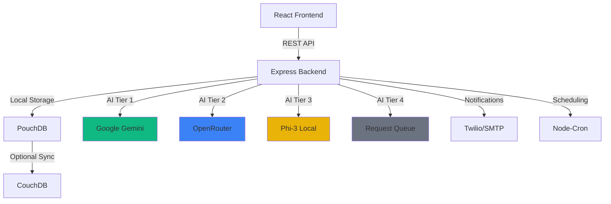

<div align="center">
  
  
  # ⚡ Taktak
  
  ### AI-Driven Offline-First Automation Platform
  
  *Shake off the manual work with intelligent workflow automation*
  
  [](https://opensource.org/licenses/MIT)
  [](https://www.typescriptlang.org/)
  [](https://reactjs.org/)
  [](https://nodejs.org/)
  
  [Features](#-features) • [Quick Start](#-quick-start) • [Architecture](#-architecture) • [Documentation](#-documentation)
  
</div>

---

## ✨ Features

<table>
<tr>
<td width="50%">

### 🎨 **Visual Workflow Builder**
Drag-and-drop interface powered by React Flow. Build complex automation workflows visually with 10+ pre-built nodes including Schedule, AI Generate, Database, SMS, Email, and more.

</td>
<td width="50%">

### 🤖 **4-Tier AI Fallback System** 🆕
**Enterprise-grade 99.9% uptime** with automatic failover:
1. **Gemini** (0.8s) - Fastest, best quality
2. **OpenRouter** (1.2s) - Multiple models fallback
3. **Phi-3 Local** (1.5s) - Offline, privacy-first
4. **Queue** - Retry when online

*Unlike Zapier/Make, Taktak works even when offline or APIs are down!*

</td>
</tr>
<tr>
<td width="50%">

### 💾 **Offline-First Architecture**
Works without internet using PouchDB local storage. Optional cloud sync to CouchDB when connectivity is available. Your data, your control.

</td>
<td width="50%">

### 📋 **12 Pre-Built Templates** 🆕
Ready-to-use workflows for:
- **Clinics**: Appointment reminders, prescription alerts, lab results
- **Stores**: Inventory alerts, order confirmations, abandoned cart recovery
- **Cooperatives**: Member onboarding, meeting reminders, payment notifications

</td>
</tr>
<tr>
<td width="50%">

### 🔐 **Enterprise Security**
JWT authentication, encrypted credentials, and secure data handling. Built with security best practices from the ground up.

</td>
<td width="50%">

### 🧠 **Local LLM Support** 🆕
Run AI workflows completely offline with Phi-3 via llama.cpp. No API keys, no internet, no data leaving your machine.

</td>
</tr>
</table>

---

## 🚀 Quick Start

### Prerequisites

```bash
Node.js 18+ • npm • (Optional) CouchDB for cloud sync
```

### Installation

```bash
# Clone the repository
git clone https://github.com/MfFischer/taktak.git
cd taktak

# Install dependencies
npm install

# Build shared types
cd packages/types && npm run build && cd ../..

# Start development servers
npm run dev:server  # Terminal 1 - Backend (port 3001)
npm run dev:client  # Terminal 2 - Frontend (port 3000)
```

### Environment Setup

Create `.env` in the root directory (copy from `.env.example`):

```env
# Server Configuration
NODE_ENV=development
SERVER_PORT=3001
JWT_SECRET=your-super-secret-jwt-key-change-this
ENCRYPTION_KEY=your-32-character-encryption-key!!

# ============================================
# AI CONFIGURATION (4-Tier Fallback System)
# ============================================
# Tier 1: Google Gemini (fastest, best quality - 0.8s)
GEMINI_API_KEY=your_gemini_api_key_here

# Tier 2: OpenRouter (fallback, multiple models - 1.2s)
# Get API key from: https://openrouter.ai/keys
OPENROUTER_API_KEY=your_openrouter_api_key_here

# Tier 3: Local Phi-3 (offline, slower - 1.5s)
# Tier 4: Queue (all providers failed - will retry when online)

# AI Mode: cloud (Gemini only), local (Phi-3 only), auto (4-tier fallback - RECOMMENDED)
AI_MODE=auto

# Local LLM Configuration (Phi-3)
LOCAL_LLM_MODEL_PATH=./models/phi-3-mini-4k-instruct-q4.gguf
LOCAL_LLM_CONTEXT_SIZE=4096
LOCAL_LLM_MAX_TOKENS=2048

# Optional: Cloud Sync
COUCHDB_URL=http://localhost:5984
COUCHDB_USER=admin
COUCHDB_PASSWORD=changeme

# Optional: Notifications
TWILIO_ACCOUNT_SID=your-twilio-sid
TWILIO_AUTH_TOKEN=your-twilio-token
SMTP_HOST=smtp.gmail.com
SMTP_PORT=587
SMTP_USER=your-email@gmail.com
SMTP_PASSWORD=your-app-password
```

### 🎉 You're Ready!

Open [http://localhost:3000](http://localhost:3000) and start automating!

---

## 🤖 AI Configuration

Taktak features a **4-tier AI fallback system** for enterprise-grade reliability:

### Quick Setup

1. **Auto Mode (Recommended)** - Set `AI_MODE=auto` in `.env`
   - Automatically tries all providers in order
   - Works offline when needed
   - 99.9% uptime guarantee

2. **Get API Keys** (Optional but recommended):
   - **Gemini**: https://makersuite.google.com/app/apikey (Free tier available)
   - **OpenRouter**: https://openrouter.ai/keys (Pay-as-you-go, $5 minimum)

3. **Download Local Model** (For offline use):
   ```bash
   # Download Phi-3 model (~2.4GB)
   cd apps/server/models
   # See README.md in that folder for download instructions
   ```

### AI Provider Comparison

| Provider | Speed | Quality | Cost | Offline | Setup |
|----------|-------|---------|------|---------|-------|
| **Gemini** | 0.8s | ⭐⭐⭐⭐⭐ | Free tier | ❌ | API key |
| **OpenRouter** | 1.2s | ⭐⭐⭐⭐ | $0.001/req | ❌ | API key |
| **Phi-3 Local** | 1.5s | ⭐⭐⭐ | Free | ✅ | Model download |
| **Queue** | N/A | N/A | Free | ✅ | None |

### How It Works

```
User Request
    ↓
┌─────────────────────────────────────┐
│  1. Try Gemini (8s timeout)         │ ← Fastest, best quality
└─────────────────────────────────────┘
    ↓ (if fails)
┌─────────────────────────────────────┐
│  2. Try OpenRouter (12s timeout)    │ ← Multiple models
└─────────────────────────────────────┘
    ↓ (if fails)
┌─────────────────────────────────────┐
│  3. Try Phi-3 Local (15s timeout)   │ ← Offline, privacy-first
└─────────────────────────────────────┘
    ↓ (if fails)
┌─────────────────────────────────────┐
│  4. Queue for later                 │ ← Retry when online
└─────────────────────────────────────┘
```

### Features

- ✅ **Request Caching** - Last 50 prompts cached for 1 hour (instant replay)
- ✅ **Smart Timeouts** - Each provider has optimized timeout settings
- ✅ **Status Tracking** - Visual indicators show which AI is being used
- ✅ **Offline Queue** - Failed requests automatically retry when online
- ✅ **Zero Downtime** - Always works, even when all cloud APIs are down

---

## 🏗️ Architecture

<div align="center">



</div>

### Tech Stack

<table>
<tr>
<td><b>Frontend</b></td>
<td>React 18 • TypeScript • Vite • Tailwind CSS • React Flow • React Router</td>
</tr>
<tr>
<td><b>Backend</b></td>
<td>Node.js • Express • TypeScript • PouchDB • JWT</td>
</tr>
<tr>
<td><b>AI Providers</b></td>
<td>Google Gemini • OpenRouter • Phi-3 (llama.cpp) • Request Queue</td>
</tr>
<tr>
<td><b>DevOps</b></td>
<td>Docker • Docker Compose • GitHub Actions • npm Workspaces</td>
</tr>
</table>

---

## 📦 Available Workflow Nodes

| Node | Description | Use Case |
|------|-------------|----------|
| ⏰ **Schedule** | Cron-based triggers | Run workflows at specific times |
| 🔀 **Condition** | Branching logic | If/else workflow paths |
| 💾 **Database** | CRUD operations | Store and retrieve data |
| 📱 **SMS** | Twilio integration | Send text messages |
| 📧 **Email** | SMTP support | Send email notifications |
| 🤖 **AI Generate** | Gemini AI | Generate text content |
| 🔗 **Webhook** | External triggers | Receive HTTP callbacks |
| 🌐 **HTTP Request** | API calls | Integrate with external services |
| 📊 **CSV Import/Export** | Data handling | Process CSV files |

---

## 📋 Pre-Built Workflow Templates

Taktak includes **12 production-ready workflow templates** for common business scenarios:

### 🏥 Clinic Templates

| Template | Description | Trigger | Actions |
|----------|-------------|---------|---------|
| **Appointment Reminder** | SMS reminders 24h before appointments | Schedule (daily) | Database → Condition → SMS |
| **Prescription Refill** | Alert patients 3 days before expiration | Schedule (daily) | Database → Condition → SMS |
| **Lab Results Notification** | Email when results are ready | Database Watch | Database → Email |
| **Post-Visit Follow-up** | SMS 2 days after visit | Schedule (daily) | Database → Condition → SMS |

### 🏪 Store Templates

| Template | Description | Trigger | Actions |
|----------|-------------|---------|---------|
| **Low Inventory Alert** | Email when stock is low | Database Watch | Database → Condition → Email |
| **Order Confirmation** | Automated order confirmations | Webhook | HTTP → Email |
| **Customer Feedback** | Post-purchase surveys | Schedule (daily) | Database → Condition → Email |
| **Abandoned Cart Recovery** | Win back lost sales | Schedule (hourly) | Database → Condition → Email |

### 🤝 Cooperative Templates

| Template | Description | Trigger | Actions |
|----------|-------------|---------|---------|
| **Member Onboarding** | Welcome new members | Webhook | HTTP → Email → SMS |
| **Meeting Reminder** | SMS 1 day before meetings | Schedule (daily) | Database → Condition → SMS |
| **Payment Reminder** | Email 3 days before due date | Schedule (daily) | Database → Condition → Email |
| **Monthly Newsletter** | Automated member updates | Schedule (monthly) | Database → Email |

### Using Templates

1. Navigate to **Templates** page in the app
2. Browse templates by category (Clinic, Store, Cooperative)
3. Click **Import Template**
4. Customize nodes and connections as needed
5. Save and activate your workflow

---

## 🐳 Docker Deployment

```bash
# Build and run all services
docker-compose up -d

# Services available at:
# - Frontend: http://localhost:3000
# - Backend: http://localhost:3001
# - CouchDB: http://localhost:5984
```

---

## 🧪 Testing

```bash
# Run server tests
cd apps/server && npm test

# Run with coverage
npm test -- --coverage
```

---

## 📁 Project Structure

```
taktak/
├── apps/
│   ├── client/              # React frontend application
│   │   ├── src/
│   │   │   ├── components/  # Reusable UI components
│   │   │   ├── pages/       # Page components
│   │   │   └── ...
│   │   └── package.json
│   └── server/              # Express backend application
│       ├── src/
│       │   ├── engine/      # Workflow execution engine
│       │   ├── routes/      # API endpoints
│       │   ├── services/    # Business logic
│       │   └── ...
│       └── package.json
├── packages/
│   └── types/               # Shared TypeScript definitions
├── docker-compose.yml       # Docker orchestration
└── package.json             # Root workspace configuration
```

---

## 🤝 Contributing

We welcome contributions! Here's how you can help:

1. 🍴 Fork the repository
2. 🌿 Create a feature branch (`git checkout -b feature/amazing-feature`)
3. 💾 Commit your changes (`git commit -m 'Add amazing feature'`)
4. 📤 Push to the branch (`git push origin feature/amazing-feature`)
5. 🎉 Open a Pull Request

---

## 📄 License

This project is licensed under the MIT License - see the [LICENSE](LICENSE) file for details.

---

## 🙏 Acknowledgments

Built with amazing open-source tools:

- [React Flow](https://reactflow.dev/) - Beautiful workflow visualization
- [Google Gemini](https://ai.google.dev/) - Powerful AI capabilities
- [PouchDB](https://pouchdb.com/) - Reliable offline-first database
- [Tailwind CSS](https://tailwindcss.com/) - Modern utility-first CSS

---

<div align="center">
  
  **Built with ❤️ for local businesses and clinics**
  
  *Taktak - Shake off the manual work* ⚡
  
</div>

